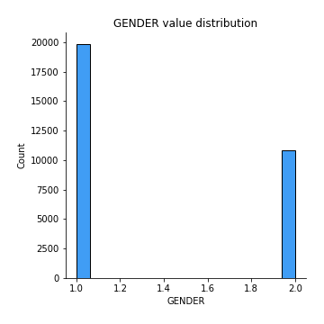

# Exploratory Data Analysis

[<< Go back](../README.md)
## Feature : target
- **Feature type** : discrete
- **Missing** : 0.0%
- **Unique** : 2
- **Count** :30636.0
- **Mean** :0.4735931583757671
- **Std** :0.49931034092417
- **Min** :0.0
- **25%th Percentile** : 0.0
- **50%th Percentile** : 0.0
- **75%th Percentile** : 1.0
- **Max** :1.0

## Feature : AGE
- **Feature type** : discrete
- **Missing** : 0.0%
- **Unique** : 27
- **Count** :30636.0
- **Mean** :54.9557383470427
- **Std** :6.360458016974033
- **Min** :39.0
- **25%th Percentile** : 50.0
- **50%th Percentile** : 56.0
- **75%th Percentile** : 60.0
- **Max** :65.0

## Feature : GENDER
- **Feature type** : discrete
- **Missing** : 0.0%
- **Unique** : 2
- **Count** :30636.0
- **Mean** :1.3525917221569395
- **Std** :0.47778473283546735
- **Min** :1.0
- **25%th Percentile** : 1.0
- **50%th Percentile** : 1.0
- **75%th Percentile** : 2.0
- **Max** :2.0

## Feature : HEIGHT
- **Feature type** : discrete
- **Missing** : 0.0%
- **Unique** : 89
- **Count** :30636.0
- **Mean** :164.28528528528528
- **Std** :8.242114414879333
- **Min** :55.0
- **25%th Percentile** : 159.0
- **50%th Percentile** : 165.0
- **75%th Percentile** : 170.0
- **Max** :250.0

## Feature : WEIGHT
- **Feature type** : discrete
- **Missing** : 0.0%
- **Unique** : 144
- **Count** :30636.0
- **Mean** :76.74836793315055
- **Std** :14.908076059315187
- **Min** :11.0
- **25%th Percentile** : 66.0
- **50%th Percentile** : 75.0
- **75%th Percentile** : 85.0
- **Max** :200.0

## Feature : AP_HIGH
- **Feature type** : discrete
- **Missing** : 0.0%
- **Unique** : 99
- **Count** :30636.0
- **Mean** :133.81440135787963
- **Std** :17.39724214201491
- **Min** :70.0
- **25%th Percentile** : 120.0
- **50%th Percentile** : 130.0
- **75%th Percentile** : 140.0
- **Max** :240.0

## Feature : AP_LOW
- **Feature type** : discrete
- **Missing** : 0.0%
- **Unique** : 76
- **Count** :30636.0
- **Mean** :84.65445880663272
- **Std** :9.923168368649428
- **Min** :40.0
- **25%th Percentile** : 80.0
- **50%th Percentile** : 80.0
- **75%th Percentile** : 90.0
- **Max** :190.0

## Feature : CHOLESTEROL
- **Feature type** : discrete
- **Missing** : 0.0%
- **Unique** : 3
- **Count** :30636.0
- **Mean** :1.5171693432562998
- **Std** :0.7776452494625422
- **Min** :1.0
- **25%th Percentile** : 1.0
- **50%th Percentile** : 1.0
- **75%th Percentile** : 2.0
- **Max** :3.0

## Feature : GLUCOSE
- **Feature type** : discrete
- **Missing** : 0.0%
- **Unique** : 3
- **Count** :30636.0
- **Mean** :1.2791160725943334
- **Std** :0.6267597316065913
- **Min** :1.0
- **25%th Percentile** : 1.0
- **50%th Percentile** : 1.0
- **75%th Percentile** : 1.0
- **Max** :3.0

## Feature : SMOKE
- **Feature type** : discrete
- **Missing** : 0.0%
- **Unique** : 2
- **Count** :30636.0
- **Mean** :0.08330069199634417
- **Std** :0.2763406943216762
- **Min** :0.0
- **25%th Percentile** : 0.0
- **50%th Percentile** : 0.0
- **75%th Percentile** : 0.0
- **Max** :1.0

## Feature : ALCOHOL
- **Feature type** : discrete
- **Missing** : 0.0%
- **Unique** : 2
- **Count** :30636.0
- **Mean** :0.051932367149758456
- **Std** :0.2218941269020126
- **Min** :0.0
- **25%th Percentile** : 0.0
- **50%th Percentile** : 0.0
- **75%th Percentile** : 0.0
- **Max** :1.0

[<< Go back](../README.md)
