# Summary of 3_Linear

[<< Go back](../README.md)

## Logistic Regression (Linear)
- **n_jobs**: -1
- **explain_level**: 2

## Validation
 - **validation_type**: split
 - **train_ratio**: 0.75
 - **shuffle**: True
 - **stratify**: True

## Optimized metric
accuracy

## Training time

3.9 seconds

## Metric details
|           |    score |     threshold |
|:----------|---------:|--------------:|
| logloss   | 0.112758 | nan           |
| auc       | 0.998333 | nan           |
| f1        | 0.96     |   0.212681    |
| accuracy  | 0.979798 |   0.212681    |
| precision | 1        |   0.497902    |
| recall    | 1        |   0.000744021 |
| mcc       | 0.947872 |   0.212681    |

## Confusion matrix (at threshold=0.212681)
|              |   Predicted as 0 |   Predicted as 1 |
|:-------------|-----------------:|-----------------:|
| Labeled as 0 |               73 |                2 |
| Labeled as 1 |                0 |               24 |

## Learning curves

## Coefficients
| feature                  |   Learner_1 |
|:-------------------------|------------:|
| Alkaline_Phosphotase     |    5.35874  |
| AGE                      |    0.474179 |
| Total_Bilirubin          |    0.449435 |
| Albumin                  |    0.193868 |
| Total_Protiens           |    0.185411 |
| Alamine_Aminotransferase |    0.17093  |
| Direct_Bilirubin         |   -0.19537  |
| GENDER                   |   -0.219175 |
| intercept                |   -1.1363   |

## Permutation-based Importance
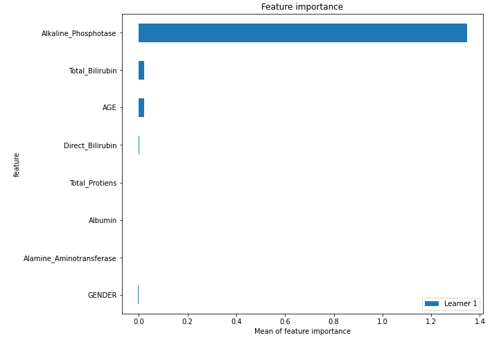
## Confusion Matrix

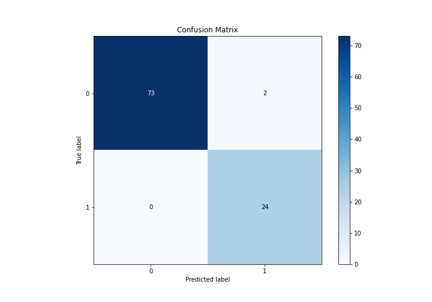

## Normalized Confusion Matrix

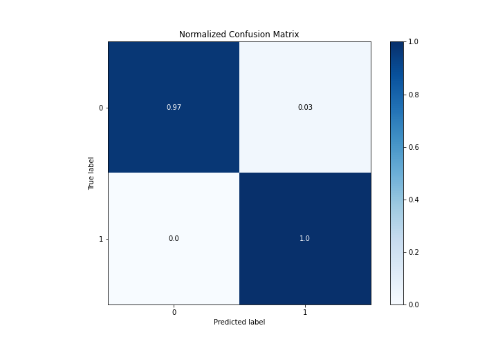

## ROC Curve

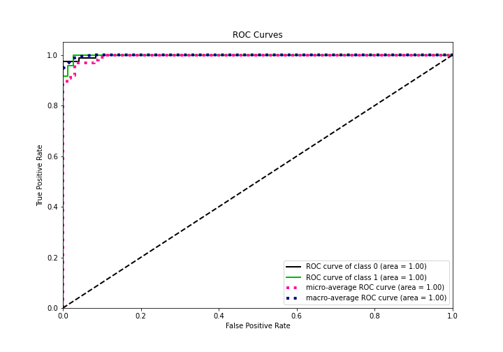

## Kolmogorov-Smirnov Statistic

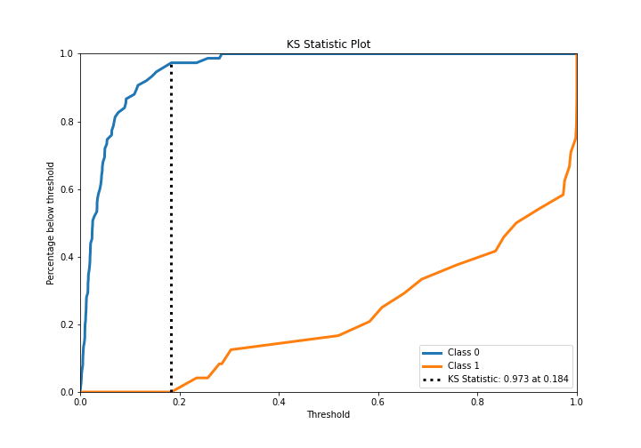

## Precision-Recall Curve

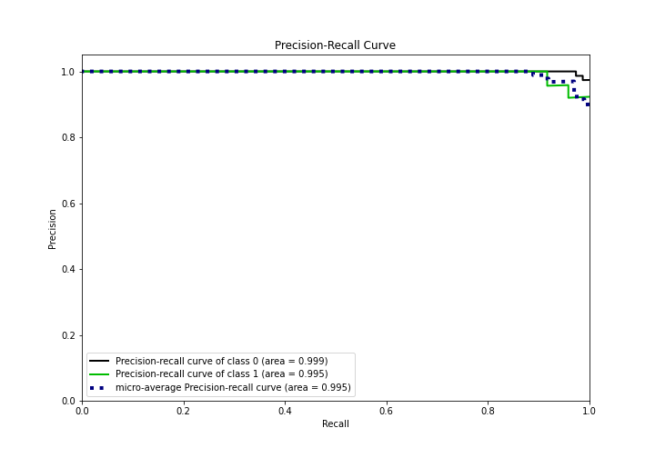

## Calibration Curve

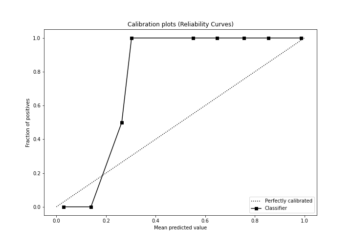

## Cumulative Gains Curve

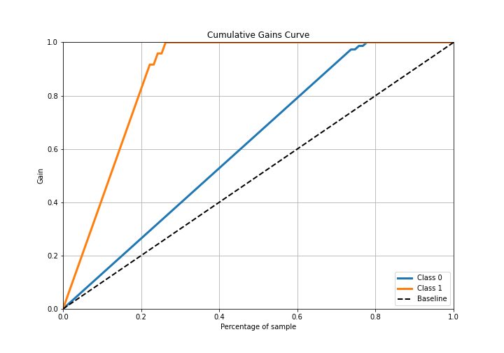

## Lift Curve

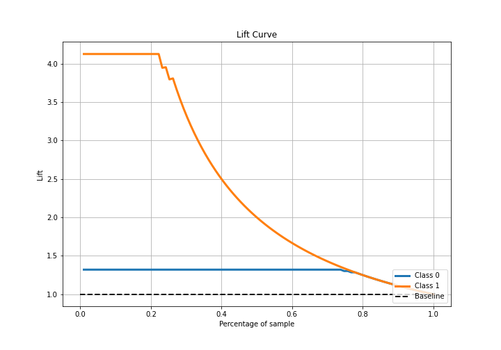

## SHAP Importance
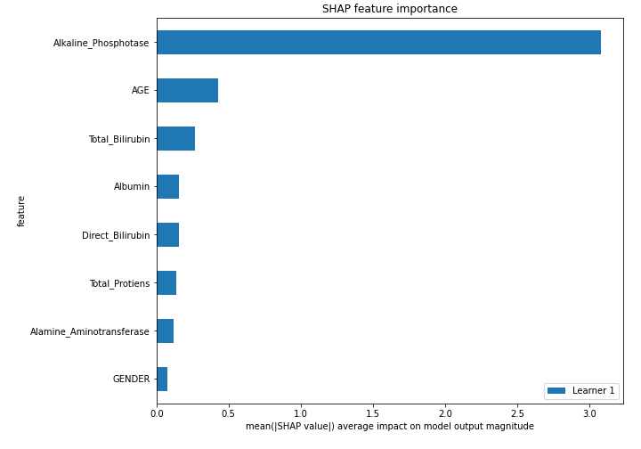

## SHAP Dependence plots

### Dependence (Fold 1)
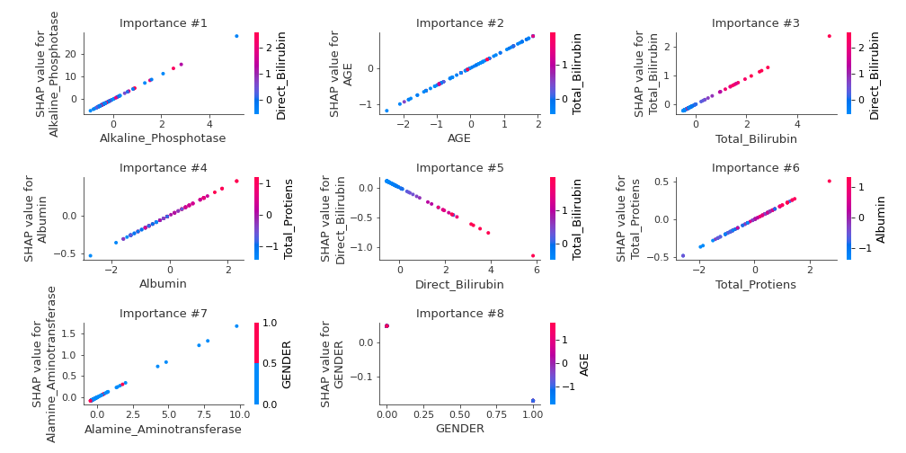

## SHAP Decision plots

### Top-10 Worst decisions for class 0 (Fold 1)
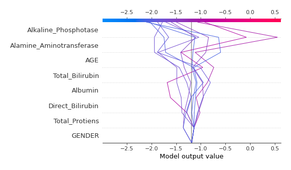
### Top-10 Best decisions for class 0 (Fold 1)
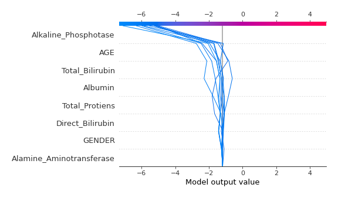
### Top-10 Worst decisions for class 1 (Fold 1)
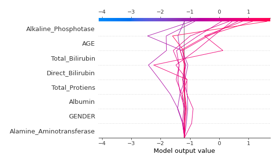
### Top-10 Best decisions for class 1 (Fold 1)
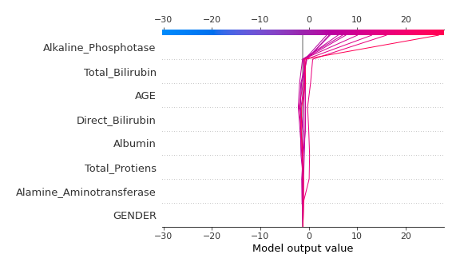

[<< Go back](../README.md)
