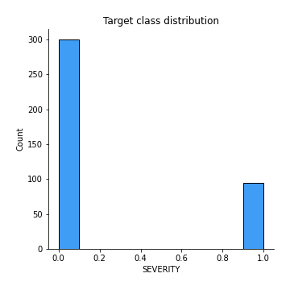
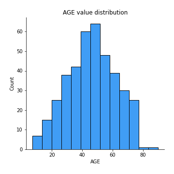
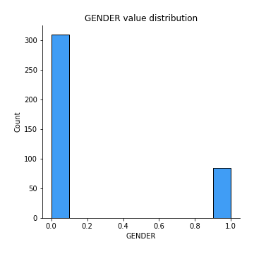
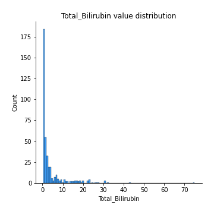
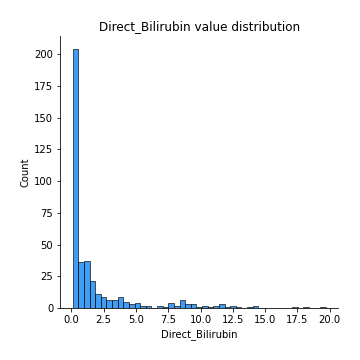
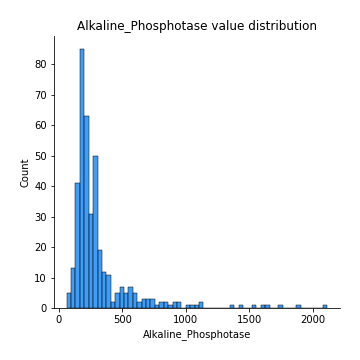
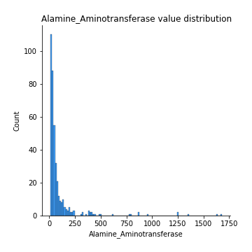
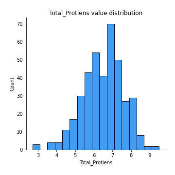
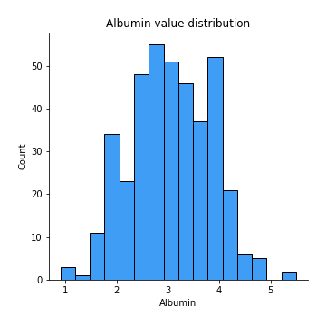

# Exploratory Data Analysis

[<< Go back](../README.md)
## Feature : target
- **Feature type** : discrete
- **Missing** : 0.0%
- **Unique** : 2
- **Count** :395.0
- **Mean** :0.24050632911392406
- **Std** :0.4279329930414863
- **Min** :0.0
- **25%th Percentile** : 0.0
- **50%th Percentile** : 0.0
- **75%th Percentile** : 0.0
- **Max** :1.0

## Feature : AGE
- **Feature type** : discrete
- **Missing** : 0.0%
- **Unique** : 67
- **Count** :395.0
- **Mean** :46.31392405063291
- **Std** :15.741009311878752
- **Min** :7.0
- **25%th Percentile** : 34.0
- **50%th Percentile** : 46.0
- **75%th Percentile** : 58.0
- **Max** :90.0

## Feature : GENDER
- **Feature type** : discrete
- **Missing** : 0.0%
- **Unique** : 2
- **Count** :395.0
- **Mean** :0.21518987341772153
- **Std** :0.41147518678386474
- **Min** :0.0
- **25%th Percentile** : 0.0
- **50%th Percentile** : 0.0
- **75%th Percentile** : 0.0
- **Max** :1.0

## Feature : Total_Bilirubin
- **Feature type** : continous
- **Missing** : 0.0%
- **Unique** : 111
- **Count** :395.0
- **Mean** :4.2187341772151905
- **Std** :7.2669758139077585
- **Min** :0.4
- **25%th Percentile** : 0.8
- **50%th Percentile** : 1.4
- **75%th Percentile** : 3.6500000000000004
- **Max** :75.0

## Feature : Direct_Bilirubin
- **Feature type** : continous
- **Missing** : 0.0%
- **Unique** : 76
- **Count** :395.0
- **Mean** :1.9458227848101264
- **Std** :3.259161475259328
- **Min** :0.1
- **25%th Percentile** : 0.2
- **50%th Percentile** : 0.5
- **75%th Percentile** : 1.8
- **Max** :19.7

## Feature : Alkaline_Phosphotase
- **Feature type** : discrete
- **Missing** : 0.0%
- **Unique** : 218
- **Count** :395.0
- **Mean** :318.2227848101266
- **Std** :267.9722237051899
- **Min** :63.0
- **25%th Percentile** : 187.5
- **50%th Percentile** : 230.0
- **75%th Percentile** : 315.0
- **Max** :2110.0

## Feature : Alamine_Aminotransferase
- **Feature type** : discrete
- **Missing** : 0.0%
- **Unique** : 140
- **Count** :395.0
- **Mean** :97.0
- **Std** :195.46050011856357
- **Min** :12.0
- **25%th Percentile** : 25.0
- **50%th Percentile** : 41.0
- **75%th Percentile** : 79.0
- **Max** :1680.0

## Feature : Total_Protiens
- **Feature type** : continous
- **Missing** : 0.0%
- **Unique** : 55
- **Count** :395.0
- **Mean** :6.453164556962025
- **Std** :1.0925492291104977
- **Min** :2.7
- **25%th Percentile** : 5.7
- **50%th Percentile** : 6.6
- **75%th Percentile** : 7.2
- **Max** :9.5

## Feature : Albumin
- **Feature type** : continous
- **Missing** : 0.0%
- **Unique** : 39
- **Count** :395.0
- **Mean** :3.0534177215189873
- **Std** :0.7874376714935482
- **Min** :0.9
- **25%th Percentile** : 2.5
- **50%th Percentile** : 3.0
- **75%th Percentile** : 3.6
- **Max** :5.5

[<< Go back](../README.md)
