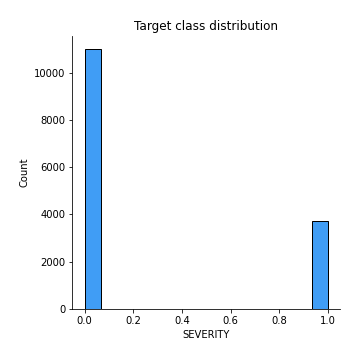
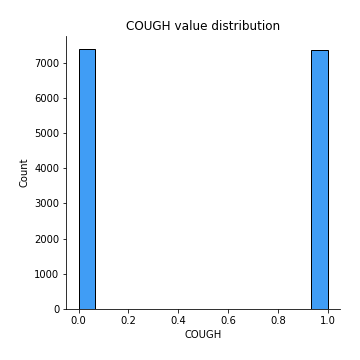
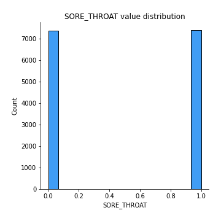
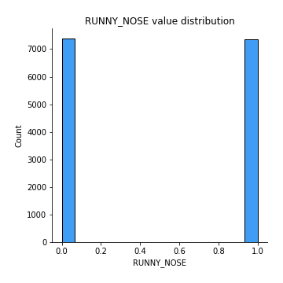
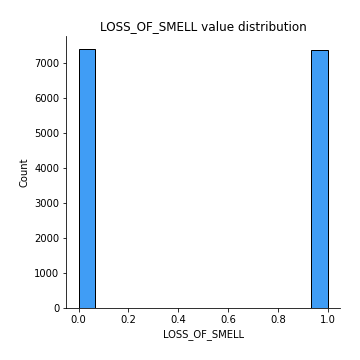
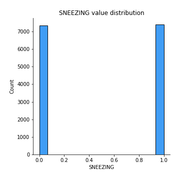
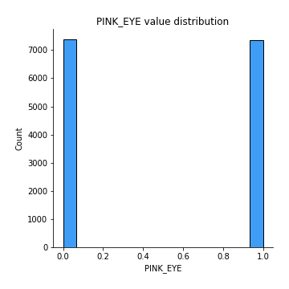

# Exploratory Data Analysis

[<< Go back](../README.md)
## Feature : target
- **Feature type** : discrete
- **Missing** : 0.0%
- **Unique** : 2
- **Count** :14742.0
- **Mean** :0.2536290869624203
- **Std** :0.43510253393438714
- **Min** :0.0
- **25%th Percentile** : 0.0
- **50%th Percentile** : 0.0
- **75%th Percentile** : 1.0
- **Max** :1.0

## Feature : COUGH
- **Feature type** : discrete
- **Missing** : 0.0%
- **Unique** : 2
- **Count** :14742.0
- **Mean** :0.4986433319766653
- **Std** :0.5000151185991556
- **Min** :0.0
- **25%th Percentile** : 0.0
- **50%th Percentile** : 0.0
- **75%th Percentile** : 1.0
- **Max** :1.0

## Feature : MUSCLE_ACHES
- **Feature type** : discrete
- **Missing** : 0.0%
- **Unique** : 2
- **Count** :14742.0
- **Mean** :0.5015601682268349
- **Std** :0.5000145249997145
- **Min** :0.0
- **25%th Percentile** : 0.0
- **50%th Percentile** : 1.0
- **75%th Percentile** : 1.0
- **Max** :1.0

## Feature : TIREDNESS
- **Feature type** : discrete
- **Missing** : 0.0%
- **Unique** : 2
- **Count** :14742.0
- **Mean** :0.49993216659883327
- **Std** :0.500016954611571
- **Min** :0.0
- **25%th Percentile** : 0.0
- **50%th Percentile** : 0.0
- **75%th Percentile** : 1.0
- **Max** :1.0

## Feature : SORE_THROAT
- **Feature type** : discrete
- **Missing** : 0.0%
- **Unique** : 2
- **Count** :14742.0
- **Mean** :0.5011531678198344
- **Std** :0.5000156293702037
- **Min** :0.0
- **25%th Percentile** : 0.0
- **50%th Percentile** : 1.0
- **75%th Percentile** : 1.0
- **Max** :1.0

## Feature : RUNNY_NOSE
- **Feature type** : discrete
- **Missing** : 0.0%
- **Unique** : 2
- **Count** :14742.0
- **Mean** :0.49898249898249897
- **Std** :0.5000159238685888
- **Min** :0.0
- **25%th Percentile** : 0.0
- **50%th Percentile** : 0.0
- **75%th Percentile** : 1.0
- **Max** :1.0

## Feature : LOSS_OF_TASTE
- **Feature type** : discrete
- **Missing** : 0.0%
- **Unique** : 2
- **Count** :14742.0
- **Mean** :0.5010853344186678
- **Std** :0.5000157812209551
- **Min** :0.0
- **25%th Percentile** : 0.0
- **50%th Percentile** : 1.0
- **75%th Percentile** : 1.0
- **Max** :1.0

## Feature : LOSS_OF_SMELL
- **Feature type** : discrete
- **Missing** : 0.0%
- **Unique** : 2
- **Count** :14742.0
- **Mean** :0.4988468321801655
- **Std** :0.5000156293702036
- **Min** :0.0
- **25%th Percentile** : 0.0
- **50%th Percentile** : 0.0
- **75%th Percentile** : 1.0
- **Max** :1.0

## Feature : SNEEZING
- **Feature type** : discrete
- **Missing** : 0.0%
- **Unique** : 2
- **Count** :14742.0
- **Mean** :0.5020350020350021
- **Std** :0.5000128178222003
- **Min** :0.0
- **25%th Percentile** : 0.0
- **50%th Percentile** : 1.0
- **75%th Percentile** : 1.0
- **Max** :1.0

## Feature : PINK_EYE
- **Feature type** : discrete
- **Missing** : 0.0%
- **Unique** : 2
- **Count** :14742.0
- **Mean** :0.4993894993894994
- **Std** :0.5000165864893212
- **Min** :0.0
- **25%th Percentile** : 0.0
- **50%th Percentile** : 0.0
- **75%th Percentile** : 1.0
- **Max** :1.0

[<< Go back](../README.md)
