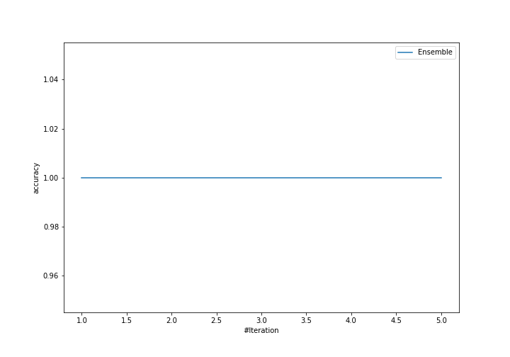
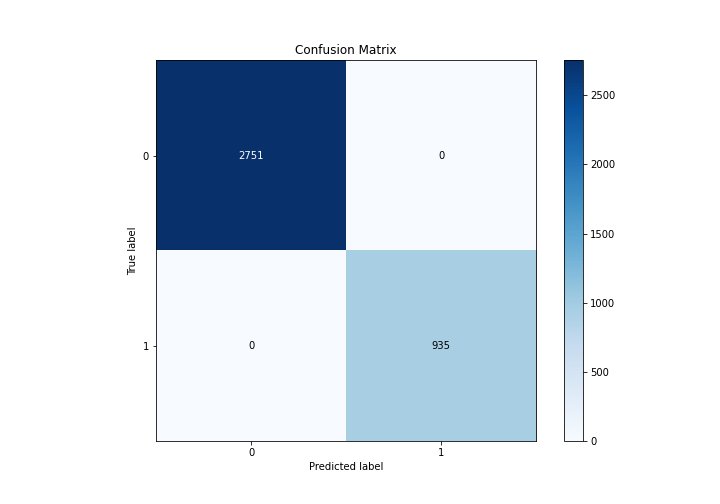
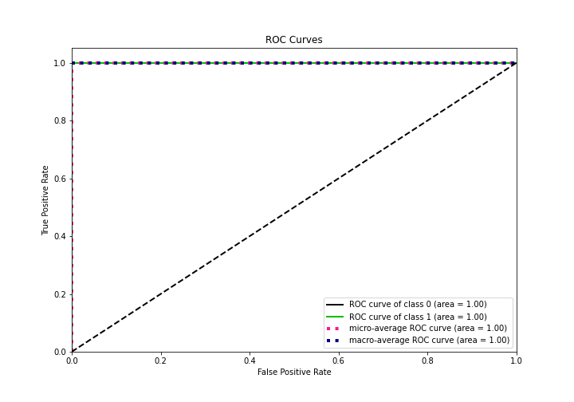
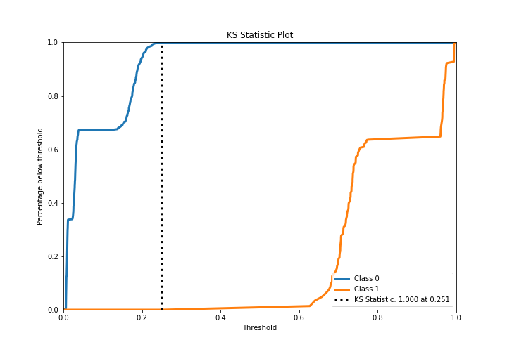
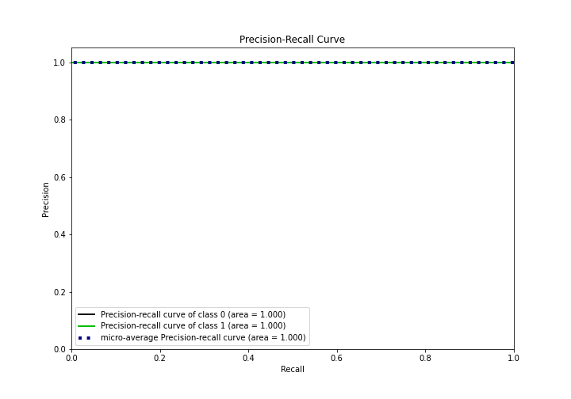
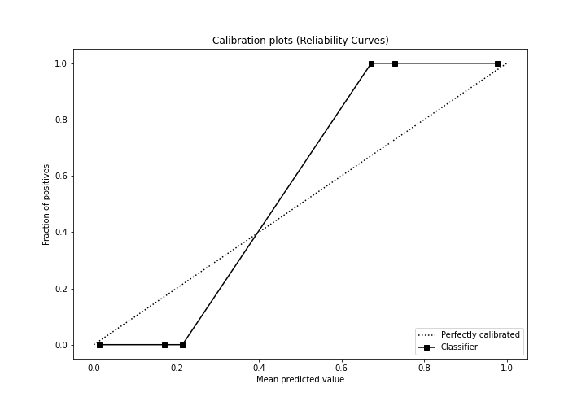
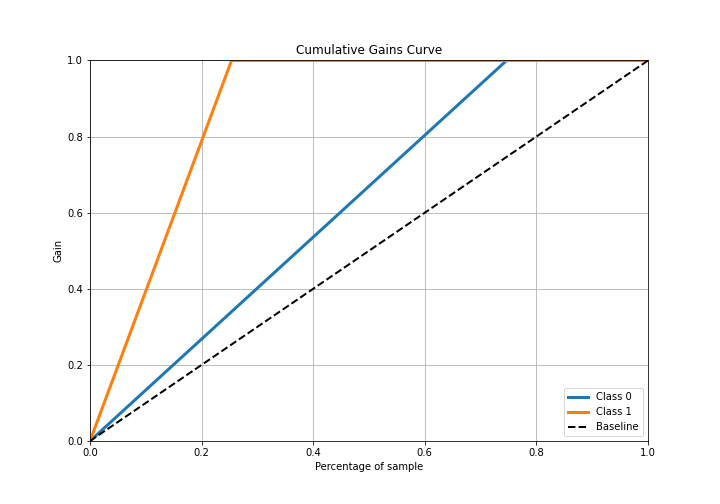
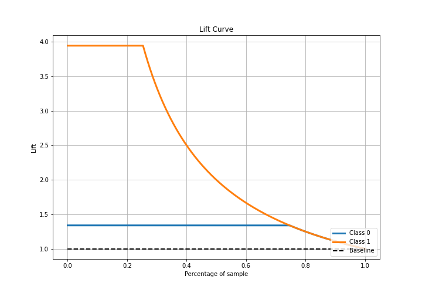

# Summary of Ensemble

[<< Go back](../README.md)

## Ensemble structure
| Model             |   Weight |
|:------------------|---------:|
| 3_Default_Xgboost |        1 |

## Metric details
|           |    score |    threshold |
|:----------|---------:|-------------:|
| logloss   | 0.116215 | nan          |
| auc       | 1        | nan          |
| f1        | 1        |   0.403692   |
| accuracy  | 1        |   0.403692   |
| precision | 1        |   0.403692   |
| recall    | 1        |   0.00554096 |
| mcc       | 1        |   0.403692   |

## Confusion matrix (at threshold=0.403692)
|              |   Predicted as 0 |   Predicted as 1 |
|:-------------|-----------------:|-----------------:|
| Labeled as 0 |             2751 |                0 |
| Labeled as 1 |                0 |              935 |

## Learning curves

## Confusion Matrix

## Normalized Confusion Matrix

## ROC Curve

## Kolmogorov-Smirnov Statistic

## Precision-Recall Curve

## Calibration Curve

## Cumulative Gains Curve

## Lift Curve

[<< Go back](../README.md)
