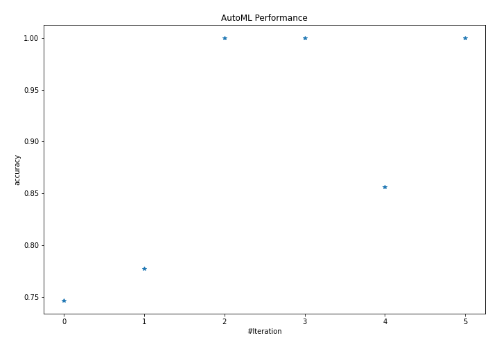
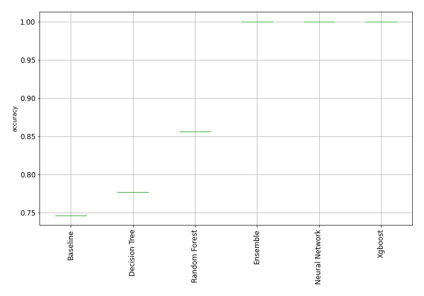
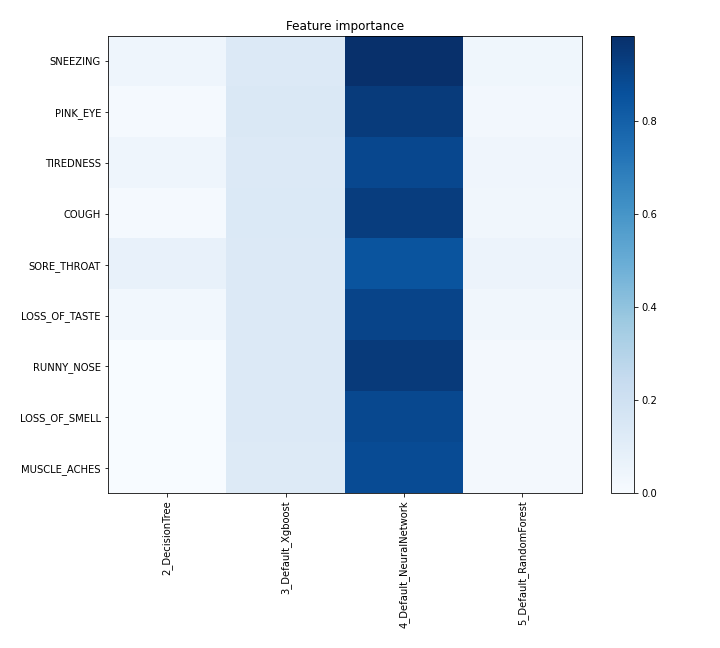
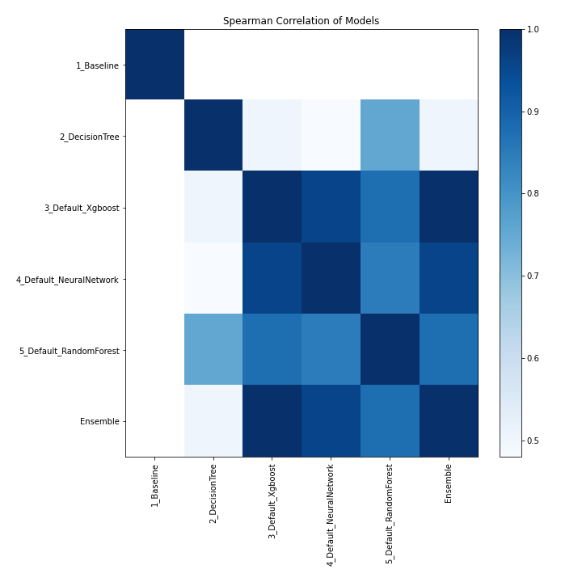

# AutoML Leaderboard

| Best model   | name                                                         | model_type     | metric_type   |   metric_value |   train_time |
|:-------------|:-------------------------------------------------------------|:---------------|:--------------|---------------:|-------------:|
|              | [1_Baseline](1_Baseline/README.md)                           | Baseline       | accuracy      |       0.746337 |         0.99 |
|              | [2_DecisionTree](2_DecisionTree/README.md)                   | Decision Tree  | accuracy      |       0.776994 |        21.18 |
| **the best** | [3_Default_Xgboost](3_Default_Xgboost/README.md)             | Xgboost        | accuracy      |       1        |         6.29 |
|              | [4_Default_NeuralNetwork](4_Default_NeuralNetwork/README.md) | Neural Network | accuracy      |       1        |         3.9  |
|              | [5_Default_RandomForest](5_Default_RandomForest/README.md)   | Random Forest  | accuracy      |       0.855941 |         5.53 |
|              | [Ensemble](Ensemble/README.md)                               | Ensemble       | accuracy      |       1        |         0.87 |

### AutoML Performance

### AutoML Performance Boxplot

### Features Importance

### Spearman Correlation of Models

