# Summary of 3_Linear

[<< Go back](../README.md)

## Logistic Regression (Linear)
- **n_jobs**: -1
- **explain_level**: 2

## Validation
 - **validation_type**: split
 - **train_ratio**: 0.75
 - **shuffle**: True
 - **stratify**: True

## Optimized metric
accuracy

## Training time

2.7 seconds

## Metric details
|           |     score |     threshold |
|:----------|----------:|--------------:|
| logloss   | 0.0821567 | nan           |
| auc       | 1         | nan           |
| f1        | 1         |   0.4976      |
| accuracy  | 1         |   0.4976      |
| precision | 1         |   0.4976      |
| recall    | 1         |   7.89703e-09 |
| mcc       | 1         |   0.4976      |

## Confusion matrix (at threshold=0.4976)
|              |   Predicted as 0 |   Predicted as 1 |
|:-------------|-----------------:|-----------------:|
| Labeled as 0 |              182 |                0 |
| Labeled as 1 |                0 |               61 |

## Learning curves
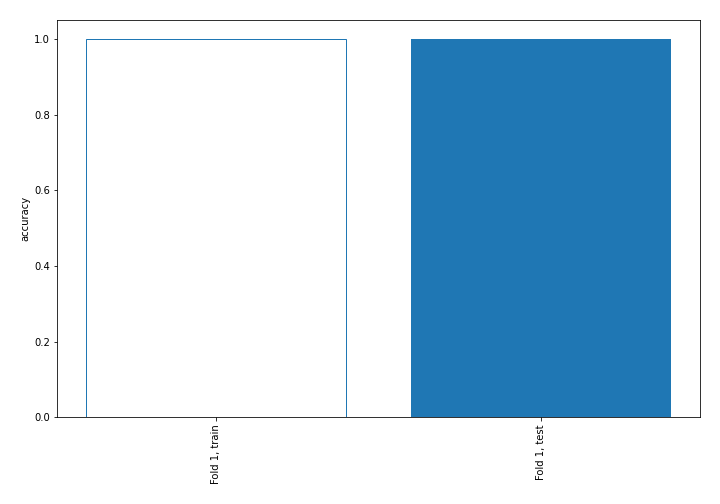

## Coefficients
| feature       |   Learner_1 |
|:--------------|------------:|
| TIREDNESS     |     3.3466  |
| COUGH         |     3.31948 |
| LOSS_OF_SMELL |     3.26862 |
| FEVER         |     3.24717 |
| LOSS_OF_TASTE |     3.23486 |
| RUNNY_NOSE    |     3.17713 |
| SORE_THROAT   |     3.17408 |
| SNEEZING      |     1.82205 |
| MUSCLE_ACHES  |     1.74105 |
| intercept     |   -15.0069  |

## Permutation-based Importance
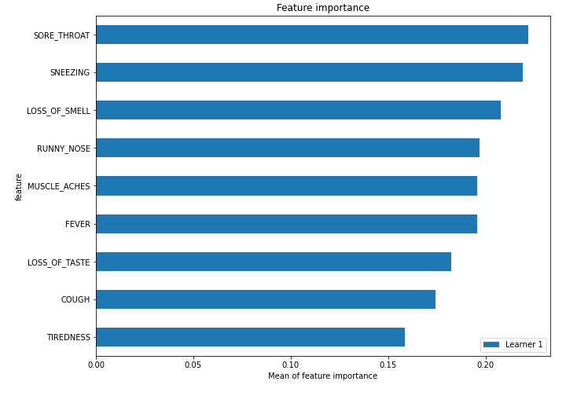
## Confusion Matrix

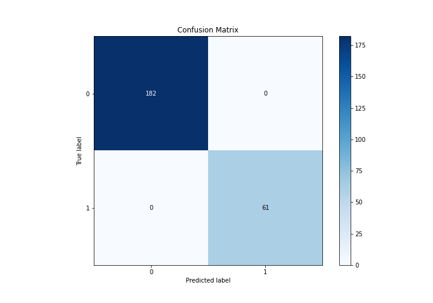

## Normalized Confusion Matrix

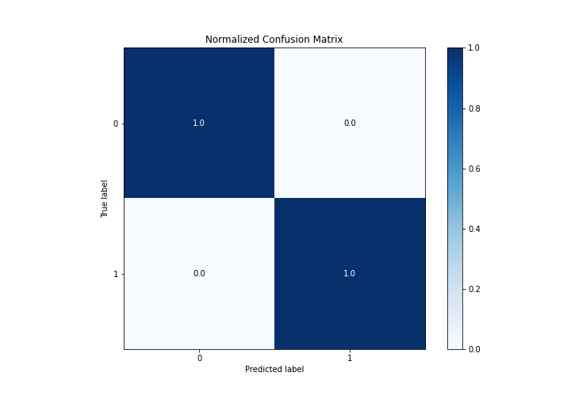

## ROC Curve

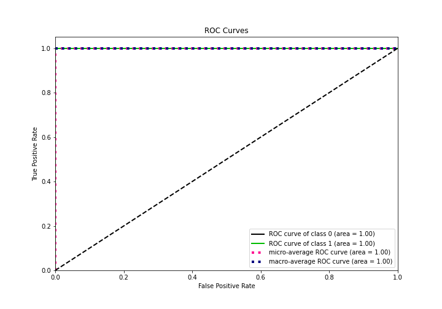

## Kolmogorov-Smirnov Statistic

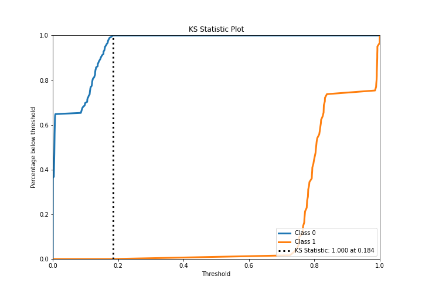

## Precision-Recall Curve

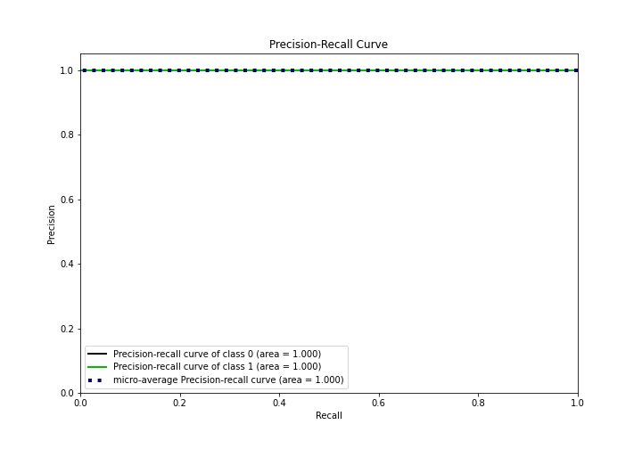

## Calibration Curve

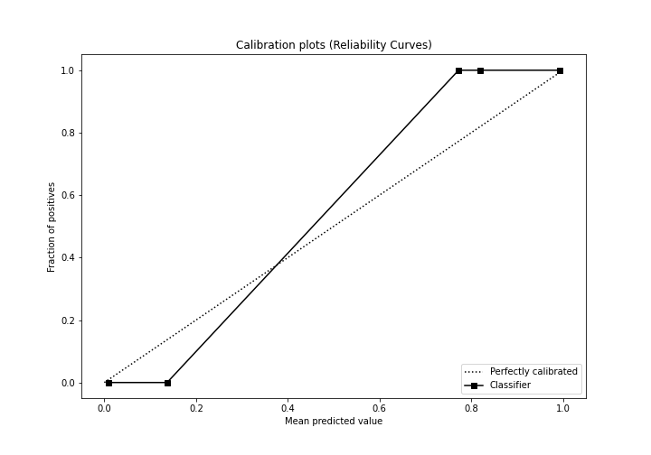

## Cumulative Gains Curve

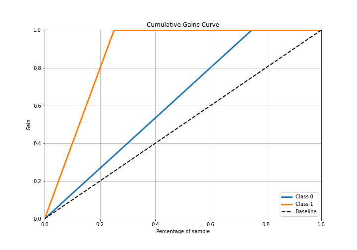

## Lift Curve

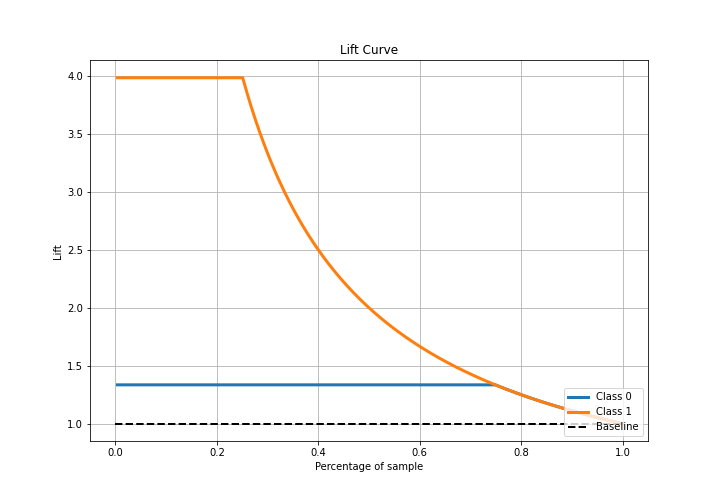

## SHAP Importance
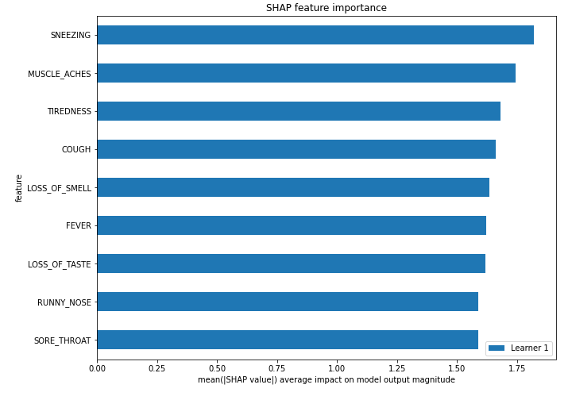

## SHAP Dependence plots

### Dependence (Fold 1)
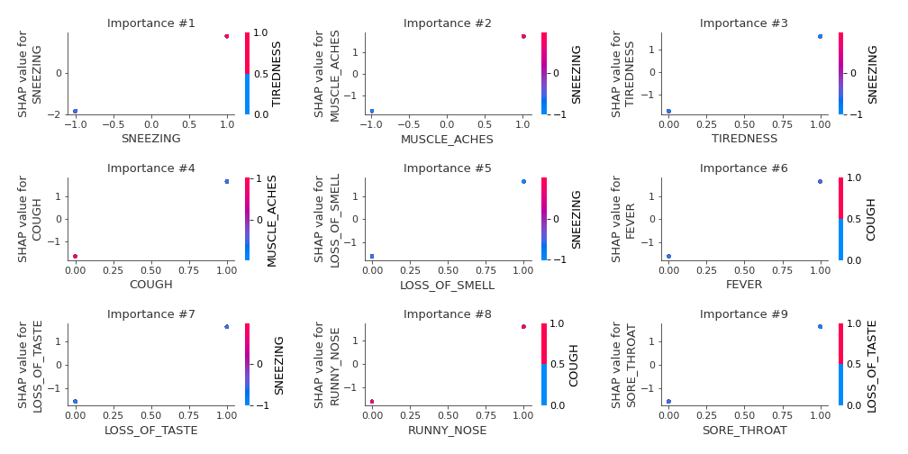

## SHAP Decision plots

### Top-10 Worst decisions for class 0 (Fold 1)
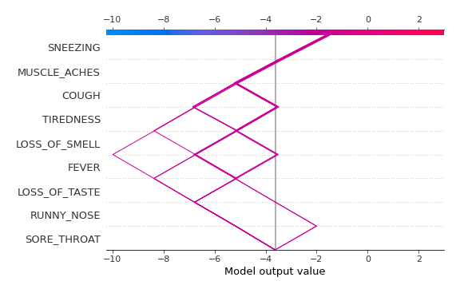
### Top-10 Best decisions for class 0 (Fold 1)

### Top-10 Worst decisions for class 1 (Fold 1)
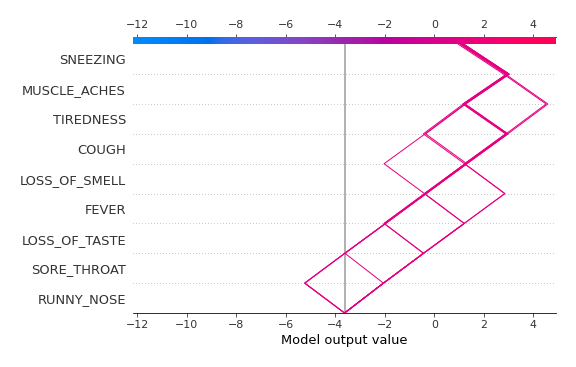
### Top-10 Best decisions for class 1 (Fold 1)
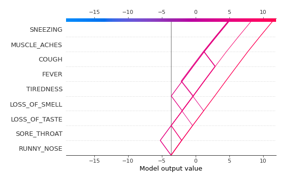

[<< Go back](../README.md)
