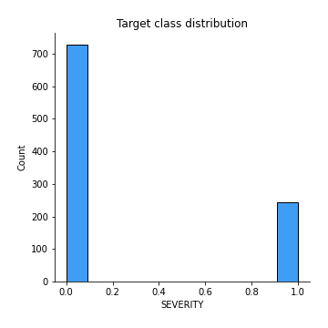
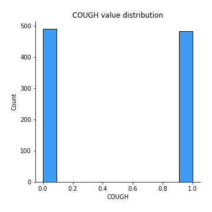
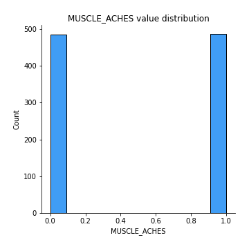
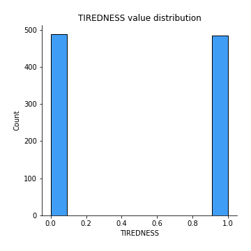
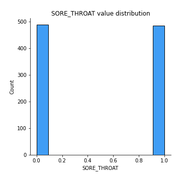
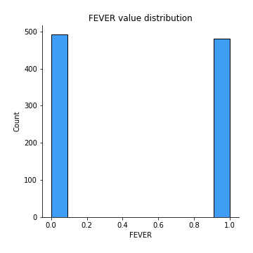
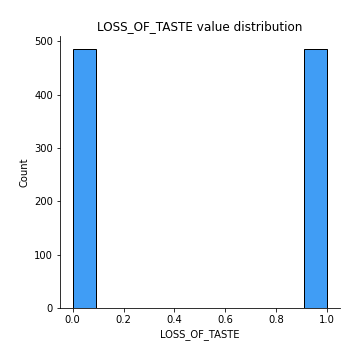
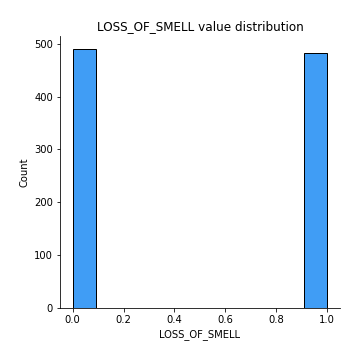
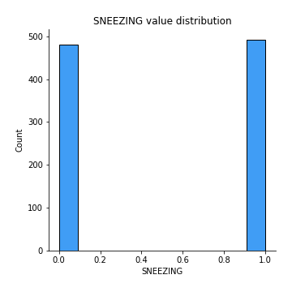

# Exploratory Data Analysis

[<< Go back](../README.md)
## Feature : target
- **Feature type** : discrete
- **Missing** : 0.0%
- **Unique** : 2
- **Count** :972.0
- **Mean** :0.25102880658436216
- **Std** :0.43382827642129684
- **Min** :0.0
- **25%th Percentile** : 0.0
- **50%th Percentile** : 0.0
- **75%th Percentile** : 1.0
- **Max** :1.0

## Feature : COUGH
- **Feature type** : discrete
- **Missing** : 0.0%
- **Unique** : 2
- **Count** :972.0
- **Mean** :0.49588477366255146
- **Std** :0.5002404561814944
- **Min** :0.0
- **25%th Percentile** : 0.0
- **50%th Percentile** : 0.0
- **75%th Percentile** : 1.0
- **Max** :1.0

## Feature : MUSCLE_ACHES
- **Feature type** : discrete
- **Missing** : 0.0%
- **Unique** : 2
- **Count** :972.0
- **Mean** :0.5010288065843621
- **Std** :0.5002563412854539
- **Min** :0.0
- **25%th Percentile** : 0.0
- **50%th Percentile** : 1.0
- **75%th Percentile** : 1.0
- **Max** :1.0

## Feature : TIREDNESS
- **Feature type** : discrete
- **Missing** : 0.0%
- **Unique** : 2
- **Count** :972.0
- **Mean** :0.49794238683127573
- **Std** :0.5002531643050154
- **Min** :0.0
- **25%th Percentile** : 0.0
- **50%th Percentile** : 0.0
- **75%th Percentile** : 1.0
- **Max** :1.0

## Feature : SORE_THROAT
- **Feature type** : discrete
- **Missing** : 0.0%
- **Unique** : 2
- **Count** :972.0
- **Mean** :0.49794238683127573
- **Std** :0.5002531643050154
- **Min** :0.0
- **25%th Percentile** : 0.0
- **50%th Percentile** : 0.0
- **75%th Percentile** : 1.0
- **Max** :1.0

## Feature : RUNNY_NOSE
- **Feature type** : discrete
- **Missing** : 0.0%
- **Unique** : 2
- **Count** :972.0
- **Mean** :0.49794238683127573
- **Std** :0.5002531643050154
- **Min** :0.0
- **25%th Percentile** : 0.0
- **50%th Percentile** : 0.0
- **75%th Percentile** : 1.0
- **Max** :1.0

## Feature : FEVER
- **Feature type** : discrete
- **Missing** : 0.0%
- **Unique** : 2
- **Count** :972.0
- **Mean** :0.49382716049382713
- **Std** :0.5002192752581789
- **Min** :0.0
- **25%th Percentile** : 0.0
- **50%th Percentile** : 0.0
- **75%th Percentile** : 1.0
- **Max** :1.0

## Feature : LOSS_OF_TASTE
- **Feature type** : discrete
- **Missing** : 0.0%
- **Unique** : 2
- **Count** :972.0
- **Mean** :0.5
- **Std** :0.5002574002744499
- **Min** :0.0
- **25%th Percentile** : 0.0
- **50%th Percentile** : 0.5
- **75%th Percentile** : 1.0
- **Max** :1.0

## Feature : LOSS_OF_SMELL
- **Feature type** : discrete
- **Missing** : 0.0%
- **Unique** : 2
- **Count** :972.0
- **Mean** :0.49588477366255146
- **Std** :0.5002404561814944
- **Min** :0.0
- **25%th Percentile** : 0.0
- **50%th Percentile** : 0.0
- **75%th Percentile** : 1.0
- **Max** :1.0

## Feature : SNEEZING
- **Feature type** : discrete
- **Missing** : 0.0%
- **Unique** : 2
- **Count** :972.0
- **Mean** :0.5061728395061729
- **Std** :0.5002192752581789
- **Min** :0.0
- **25%th Percentile** : 0.0
- **50%th Percentile** : 1.0
- **75%th Percentile** : 1.0
- **Max** :1.0

[<< Go back](../README.md)
