# Summary of 3_Linear

[<< Go back](../README.md)

## Logistic Regression (Linear)
- **n_jobs**: -1
- **explain_level**: 2

## Validation
 - **validation_type**: split
 - **train_ratio**: 0.75
 - **shuffle**: True
 - **stratify**: True

## Optimized metric
accuracy

## Training time

2.7 seconds

## Metric details
|           |    score |    threshold |
|:----------|---------:|-------------:|
| logloss   | 0.106642 | nan          |
| auc       | 0.997101 | nan          |
| f1        | 0.978723 |   0.342291   |
| accuracy  | 0.973684 |   0.560936   |
| precision | 1        |   0.977425   |
| recall    | 1        |   5.5417e-06 |
| mcc       | 0.946963 |   0.560936   |

## Confusion matrix (at threshold=0.560936)
|              |   Predicted as 0 |   Predicted as 1 |
|:-------------|-----------------:|-----------------:|
| Labeled as 0 |               30 |                0 |
| Labeled as 1 |                2 |               44 |

## Learning curves
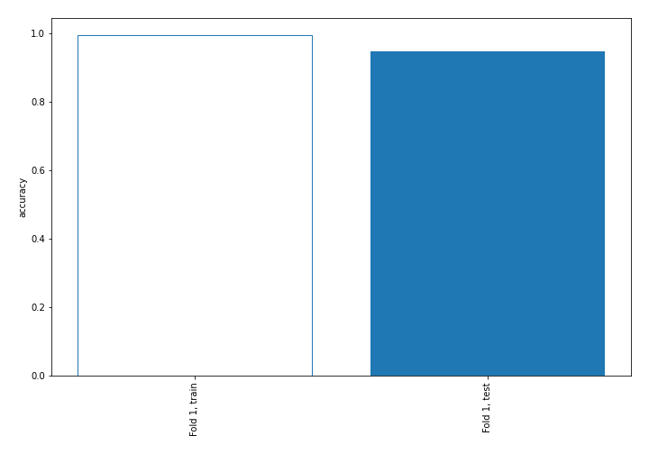

## Coefficients
| feature            |   Learner_1 |
|:-------------------|------------:|
| PARTIAL_PARESIS    |    1.74653  |
| MUSCLE_STIFFNESS   |    1.67068  |
| POLYPHAGIA         |    1.59762  |
| DELAYED_HEALING    |    1.47837  |
| ITCHING            |    1.3438   |
| VISUAL_BLURRING    |    1.17016  |
| POLYDIPSIA         |    1.16454  |
| WEAKNESS           |    1.01093  |
| SUDDEN_WEIGHT_LOSS |    0.927536 |
| POLYURIA           |    0.892691 |
| intercept          |   -0.641262 |

## Permutation-based Importance
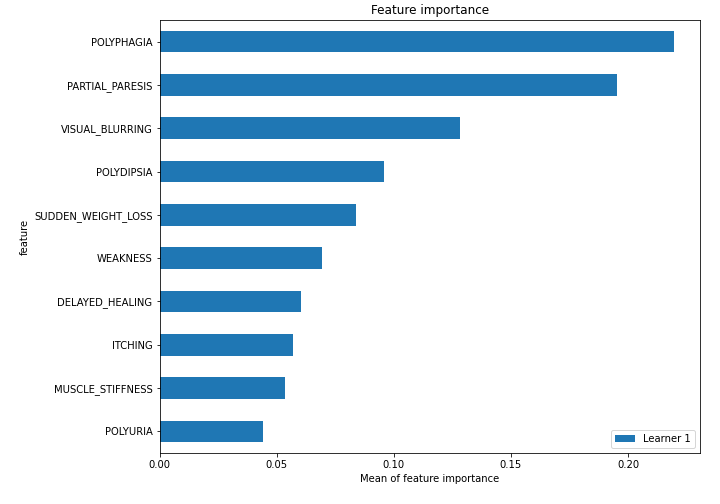
## Confusion Matrix

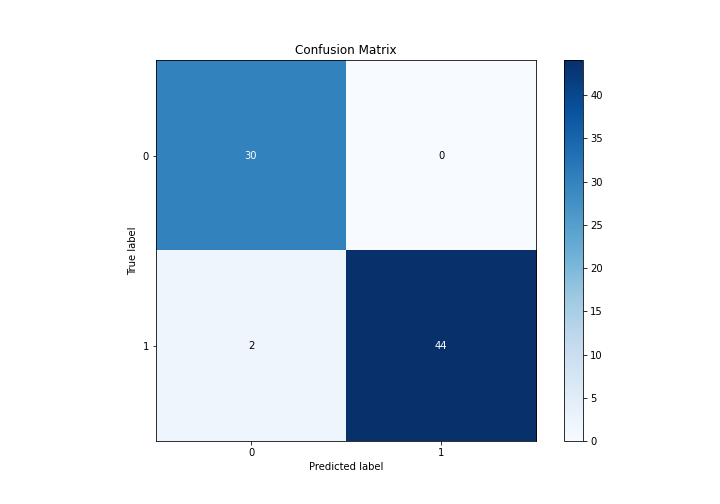

## Normalized Confusion Matrix

## ROC Curve

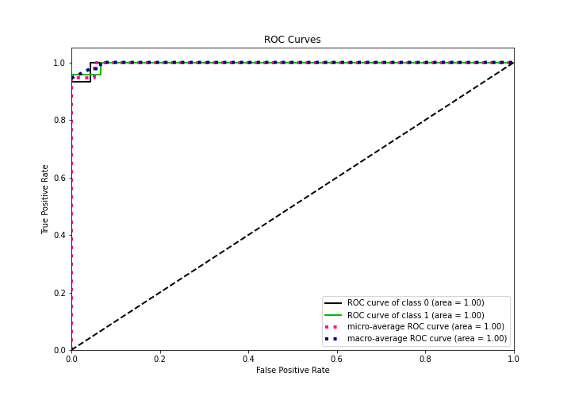

## Kolmogorov-Smirnov Statistic

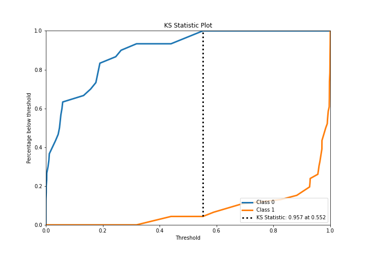

## Precision-Recall Curve

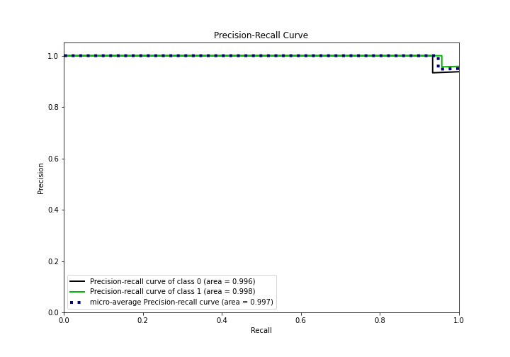

## Calibration Curve

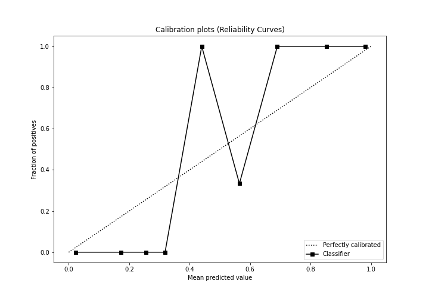

## Cumulative Gains Curve

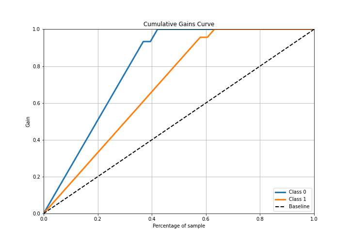

## Lift Curve

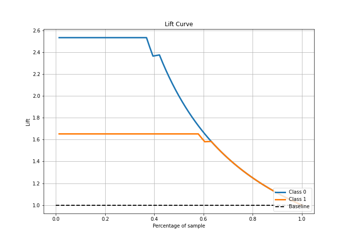

## SHAP Importance
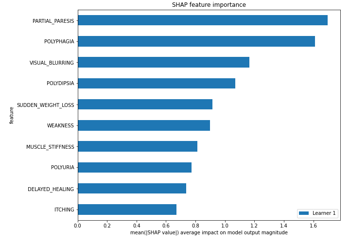

## SHAP Dependence plots

### Dependence (Fold 1)
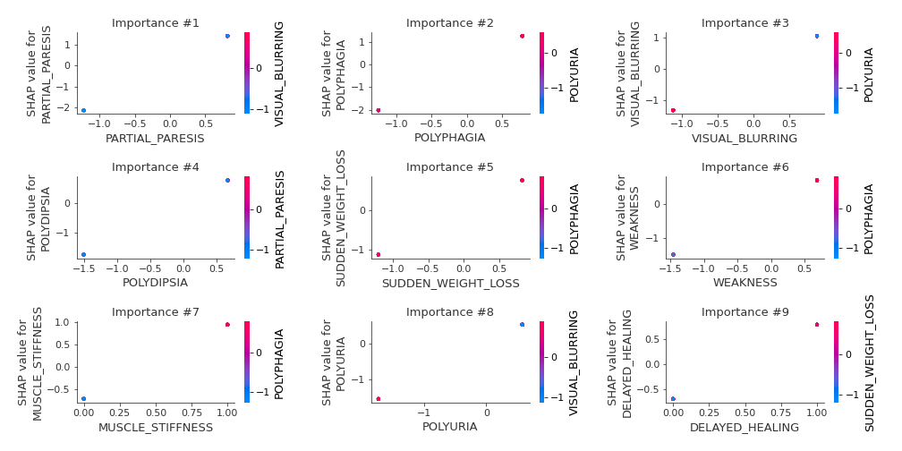

## SHAP Decision plots

### Top-10 Worst decisions for class 0 (Fold 1)
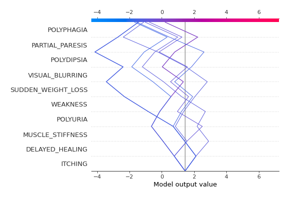
### Top-10 Best decisions for class 0 (Fold 1)
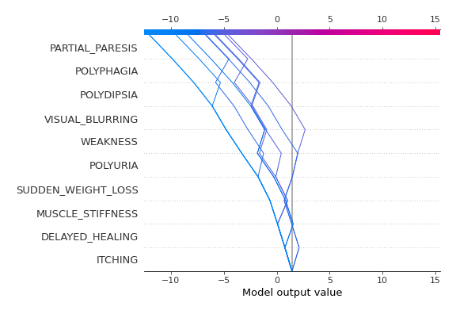
### Top-10 Worst decisions for class 1 (Fold 1)
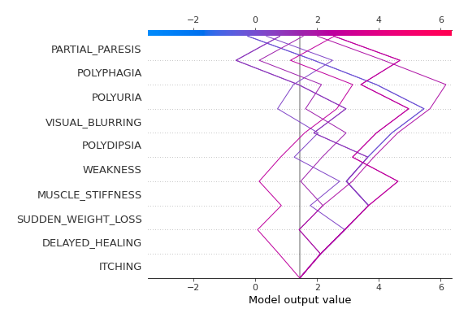
### Top-10 Best decisions for class 1 (Fold 1)
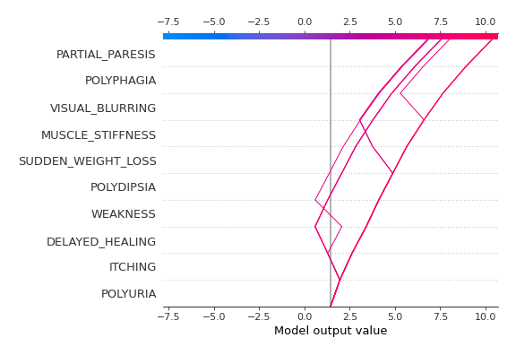

[<< Go back](../README.md)
