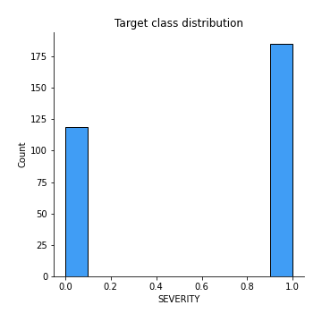
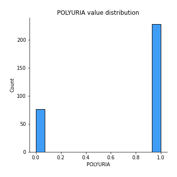
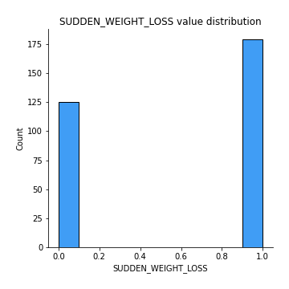
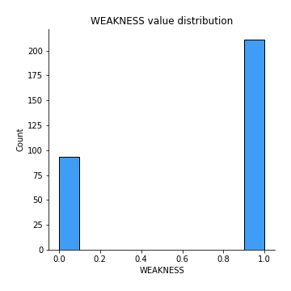
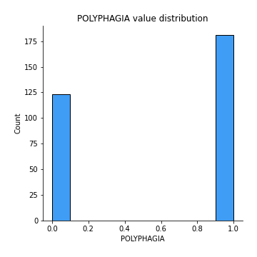
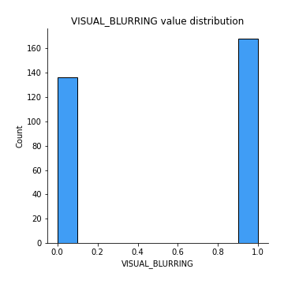
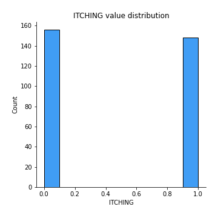
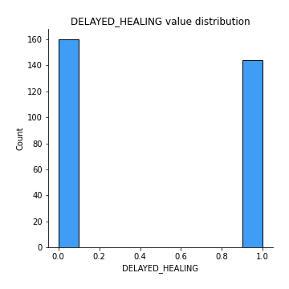
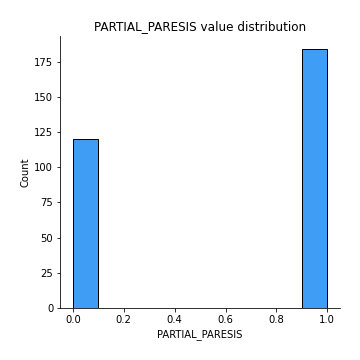
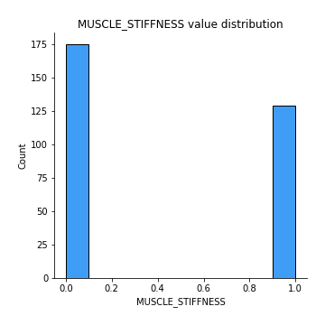

# Exploratory Data Analysis

[<< Go back](../README.md)
## Feature : target
- **Feature type** : discrete
- **Missing** : 0.0%
- **Unique** : 2
- **Count** :304.0
- **Mean** :0.6085526315789473
- **Std** :0.48887883843844165
- **Min** :0.0
- **25%th Percentile** : 0.0
- **50%th Percentile** : 1.0
- **75%th Percentile** : 1.0
- **Max** :1.0

## Feature : POLYURIA
- **Feature type** : discrete
- **Missing** : 0.0%
- **Unique** : 2
- **Count** :304.0
- **Mean** :0.75
- **Std** :0.4337266557190002
- **Min** :0.0
- **25%th Percentile** : 0.75
- **50%th Percentile** : 1.0
- **75%th Percentile** : 1.0
- **Max** :1.0

## Feature : POLYDIPSIA
- **Feature type** : discrete
- **Missing** : 0.0%
- **Unique** : 2
- **Count** :304.0
- **Mean** :0.694078947368421
- **Std** :0.4615562071520699
- **Min** :0.0
- **25%th Percentile** : 0.0
- **50%th Percentile** : 1.0
- **75%th Percentile** : 1.0
- **Max** :1.0

## Feature : SUDDEN_WEIGHT_LOSS
- **Feature type** : discrete
- **Missing** : 0.0%
- **Unique** : 2
- **Count** :304.0
- **Mean** :0.5888157894736842
- **Std** :0.4928598220978441
- **Min** :0.0
- **25%th Percentile** : 0.0
- **50%th Percentile** : 1.0
- **75%th Percentile** : 1.0
- **Max** :1.0

## Feature : WEAKNESS
- **Feature type** : discrete
- **Missing** : 0.0%
- **Unique** : 2
- **Count** :304.0
- **Mean** :0.694078947368421
- **Std** :0.4615562071520699
- **Min** :0.0
- **25%th Percentile** : 0.0
- **50%th Percentile** : 1.0
- **75%th Percentile** : 1.0
- **Max** :1.0

## Feature : POLYPHAGIA
- **Feature type** : discrete
- **Missing** : 0.0%
- **Unique** : 2
- **Count** :304.0
- **Mean** :0.5953947368421053
- **Std** :0.49162474833304304
- **Min** :0.0
- **25%th Percentile** : 0.0
- **50%th Percentile** : 1.0
- **75%th Percentile** : 1.0
- **Max** :1.0

## Feature : VISUAL_BLURRING
- **Feature type** : discrete
- **Missing** : 0.0%
- **Unique** : 2
- **Count** :304.0
- **Mean** :0.5526315789473685
- **Std** :0.4980420235455043
- **Min** :0.0
- **25%th Percentile** : 0.0
- **50%th Percentile** : 1.0
- **75%th Percentile** : 1.0
- **Max** :1.0

## Feature : ITCHING
- **Feature type** : discrete
- **Missing** : 0.0%
- **Unique** : 2
- **Count** :304.0
- **Mean** :0.4868421052631579
- **Std** :0.5006509571823132
- **Min** :0.0
- **25%th Percentile** : 0.0
- **50%th Percentile** : 0.0
- **75%th Percentile** : 1.0
- **Max** :1.0

## Feature : DELAYED_HEALING
- **Feature type** : discrete
- **Missing** : 0.0%
- **Unique** : 2
- **Count** :304.0
- **Mean** :0.47368421052631576
- **Std** :0.5001302592180493
- **Min** :0.0
- **25%th Percentile** : 0.0
- **50%th Percentile** : 0.0
- **75%th Percentile** : 1.0
- **Max** :1.0

## Feature : PARTIAL_PARESIS
- **Feature type** : discrete
- **Missing** : 0.0%
- **Unique** : 2
- **Count** :304.0
- **Mean** :0.6052631578947368
- **Std** :0.4896000217978449
- **Min** :0.0
- **25%th Percentile** : 0.0
- **50%th Percentile** : 1.0
- **75%th Percentile** : 1.0
- **Max** :1.0

## Feature : MUSCLE_STIFFNESS
- **Feature type** : discrete
- **Missing** : 0.0%
- **Unique** : 2
- **Count** :304.0
- **Mean** :0.4243421052631579
- **Std** :0.49505764714513123
- **Min** :0.0
- **25%th Percentile** : 0.0
- **50%th Percentile** : 0.0
- **75%th Percentile** : 1.0
- **Max** :1.0

[<< Go back](../README.md)
