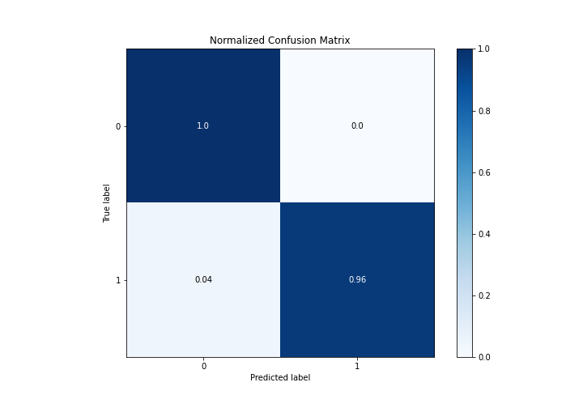

# Summary of Ensemble

[<< Go back](../README.md)

## Ensemble structure
| Model      |   Weight |
|:-----------|---------:|
| 1_Baseline |        1 |
| 3_Linear   |        1 |

## Metric details
|           |    score |   threshold |
|:----------|---------:|------------:|
| logloss   | 0.340693 |  nan        |
| auc       | 0.997101 |  nan        |
| f1        | 0.978723 |    0.47597  |
| accuracy  | 0.973684 |    0.585293 |
| precision | 1        |    0.793537 |
| recall    | 1        |    0.274345 |
| mcc       | 0.946963 |    0.585293 |

## Confusion matrix (at threshold=0.585293)
|              |   Predicted as 0 |   Predicted as 1 |
|:-------------|-----------------:|-----------------:|
| Labeled as 0 |               30 |                0 |
| Labeled as 1 |                2 |               44 |

## Learning curves

## Confusion Matrix

## Normalized Confusion Matrix

## ROC Curve

## Kolmogorov-Smirnov Statistic

## Precision-Recall Curve

## Calibration Curve

## Cumulative Gains Curve

## Lift Curve

[<< Go back](../README.md)
