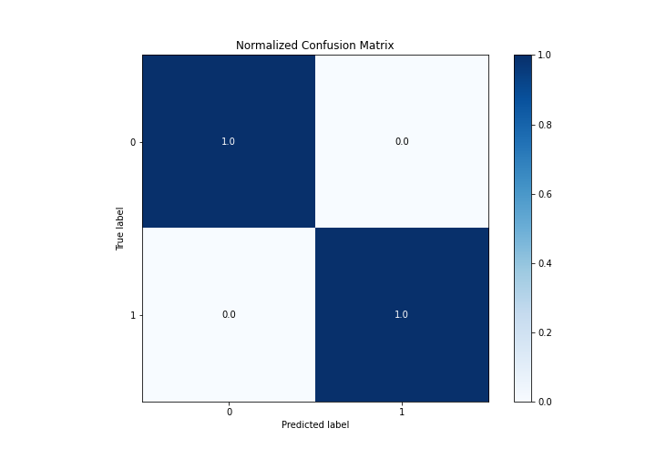
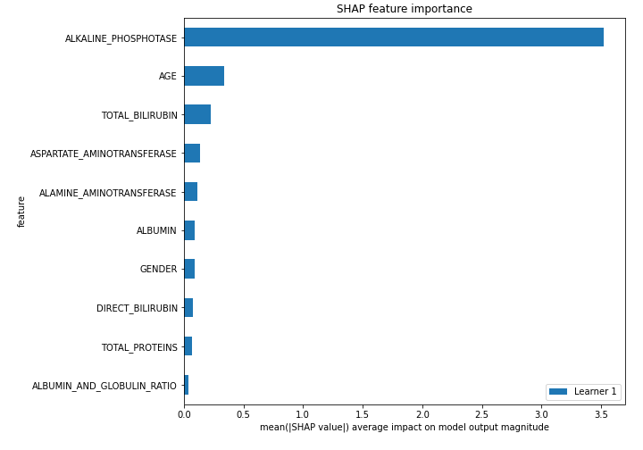

# Summary of 3_Linear

[<< Go back](../README.md)

## Logistic Regression (Linear)
- **n_jobs**: -1
- **explain_level**: 2

## Validation
 - **validation_type**: split
 - **train_ratio**: 0.75
 - **shuffle**: True
 - **stratify**: True

## Optimized metric
accuracy

## Training time

3.0 seconds

## Metric details
|           |     score |    threshold |
|:----------|----------:|-------------:|
| logloss   | 0.0924805 | nan          |
| auc       | 1         | nan          |
| f1        | 1         |   0.306397   |
| accuracy  | 1         |   0.306397   |
| precision | 1         |   0.506758   |
| recall    | 1         |   0.00286508 |
| mcc       | 1         |   0.306397   |

## Confusion matrix (at threshold=0.306397)
|              |   Predicted as 0 |   Predicted as 1 |
|:-------------|-----------------:|-----------------:|
| Labeled as 0 |               74 |                0 |
| Labeled as 1 |                0 |               25 |

## Learning curves

## Coefficients
| feature                    |   Learner_1 |
|:---------------------------|------------:|
| ALKALINE_PHOSPHOTASE       |   5.4762    |
| TOTAL_BILIRUBIN            |   0.469458  |
| AGE                        |   0.38142   |
| ASPARTATE_AMINOTRANSFERASE |   0.36504   |
| ALBUMIN                    |   0.120029  |
| GENDER                     |   0.112382  |
| TOTAL_PROTEINS             |   0.0840827 |
| ALBUMIN_AND_GLOBULIN_RATIO |   0.0569469 |
| DIRECT_BILIRUBIN           |  -0.13313   |
| ALAMINE_AMINOTRANSFERASE   |  -0.29203   |
| intercept                  |  -1.0745    |

## Permutation-based Importance

## Confusion Matrix

## Normalized Confusion Matrix

## ROC Curve

## Kolmogorov-Smirnov Statistic

## Precision-Recall Curve

## Calibration Curve

## Cumulative Gains Curve

## Lift Curve

## SHAP Importance

## SHAP Dependence plots

### Dependence (Fold 1)

## SHAP Decision plots

### Top-10 Worst decisions for class 0 (Fold 1)

### Top-10 Best decisions for class 0 (Fold 1)

### Top-10 Worst decisions for class 1 (Fold 1)

### Top-10 Best decisions for class 1 (Fold 1)

[<< Go back](../README.md)
