# Exploratory Data Analysis

[<< Go back](../README.md)
## Feature : target
- **Feature type** : discrete
- **Missing** : 0.0%
- **Unique** : 2
- **Count** :393.0
- **Mean** :0.25190839694656486
- **Std** :0.43466228006341157
- **Min** :0.0
- **25%th Percentile** : 0.0
- **50%th Percentile** : 0.0
- **75%th Percentile** : 1.0
- **Max** :1.0

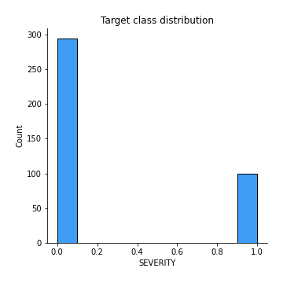
## Feature : AGE
- **Feature type** : discrete
- **Missing** : 0.0%
- **Unique** : 67
- **Count** :393.0
- **Mean** :46.29262086513995
- **Std** :15.63122109627018
- **Min** :7.0
- **25%th Percentile** : 34.0
- **50%th Percentile** : 46.0
- **75%th Percentile** : 58.0
- **Max** :90.0

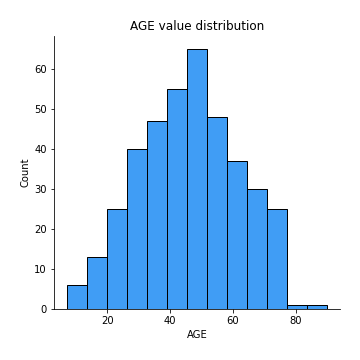
## Feature : GENDER
- **Feature type** : discrete
- **Missing** : 0.0%
- **Unique** : 2
- **Count** :393.0
- **Mean** :0.7760814249363868
- **Std** :0.4173995216815721
- **Min** :0.0
- **25%th Percentile** : 1.0
- **50%th Percentile** : 1.0
- **75%th Percentile** : 1.0
- **Max** :1.0

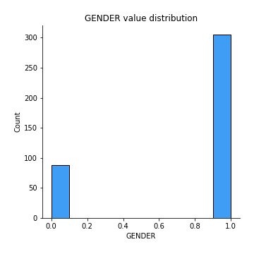
## Feature : TOTAL_BILIRUBIN
- **Feature type** : continous
- **Missing** : 0.0%
- **Unique** : 109
- **Count** :393.0
- **Mean** :4.226208651399491
- **Std** :7.265044217123644
- **Min** :0.4
- **25%th Percentile** : 0.8
- **50%th Percentile** : 1.4
- **75%th Percentile** : 3.7
- **Max** :75.0

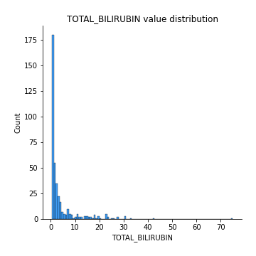
## Feature : DIRECT_BILIRUBIN
- **Feature type** : continous
- **Missing** : 0.0%
- **Unique** : 77
- **Count** :393.0
- **Mean** :1.9531806615776082
- **Std** :3.248923889415834
- **Min** :0.1
- **25%th Percentile** : 0.2
- **50%th Percentile** : 0.5
- **75%th Percentile** : 1.8
- **Max** :19.7

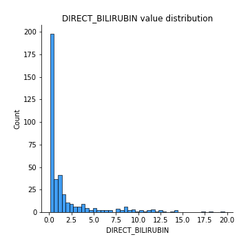
## Feature : ALKALINE_PHOSPHOTASE
- **Feature type** : discrete
- **Missing** : 0.0%
- **Unique** : 216
- **Count** :393.0
- **Mean** :322.0025445292621
- **Std** :274.6003914664159
- **Min** :63.0
- **25%th Percentile** : 185.0
- **50%th Percentile** : 224.0
- **75%th Percentile** : 320.0
- **Max** :2110.0

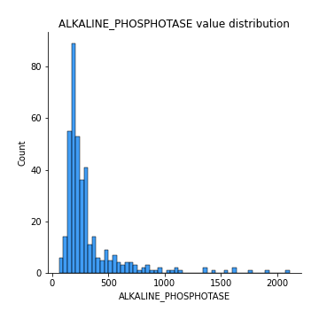
## Feature : ALAMINE_AMINOTRANSFERASE
- **Feature type** : discrete
- **Missing** : 0.0%
- **Unique** : 141
- **Count** :393.0
- **Mean** :102.70483460559797
- **Std** :218.36554122368736
- **Min** :12.0
- **25%th Percentile** : 25.0
- **50%th Percentile** : 41.0
- **75%th Percentile** : 79.0
- **Max** :2000.0

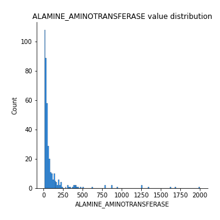
## Feature : ASPARTATE_AMINOTRANSFERASE
- **Feature type** : discrete
- **Missing** : 0.0%
- **Unique** : 165
- **Count** :393.0
- **Mean** :142.13486005089058
- **Std** :346.37761721154294
- **Min** :11.0
- **25%th Percentile** : 30.0
- **50%th Percentile** : 53.0
- **75%th Percentile** : 113.0
- **Max** :4929.0

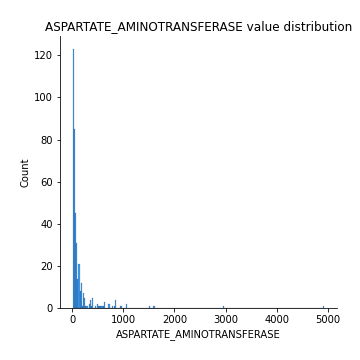
## Feature : TOTAL_PROTEINS
- **Feature type** : continous
- **Missing** : 0.0%
- **Unique** : 55
- **Count** :393.0
- **Mean** :6.453944020356234
- **Std** :1.1015022056733172
- **Min** :2.7
- **25%th Percentile** : 5.7
- **50%th Percentile** : 6.5
- **75%th Percentile** : 7.2
- **Max** :9.5

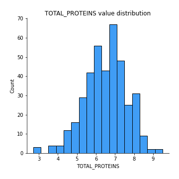
## Feature : ALBUMIN
- **Feature type** : continous
- **Missing** : 0.0%
- **Unique** : 39
- **Count** :393.0
- **Mean** :3.0572519083969465
- **Std** :0.7825615840359458
- **Min** :0.9
- **25%th Percentile** : 2.5
- **50%th Percentile** : 3.0
- **75%th Percentile** : 3.6
- **Max** :5.5

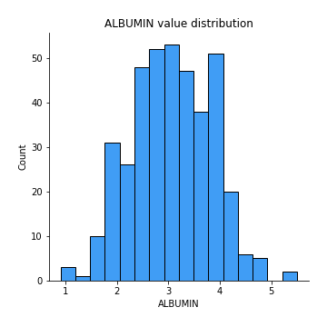
## Feature : ALBUMIN_AND_GLOBULIN_RATIO
- **Feature type** : continous
- **Missing** : 0.0%
- **Unique** : 54
- **Count** :393.0
- **Mean** :0.9150381679389313
- **Std** :0.32634190951644426
- **Min** :0.3
- **25%th Percentile** : 0.7
- **50%th Percentile** : 0.9
- **75%th Percentile** : 1.1
- **Max** :2.8

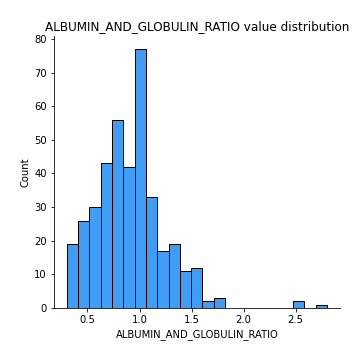

[<< Go back](../README.md)
