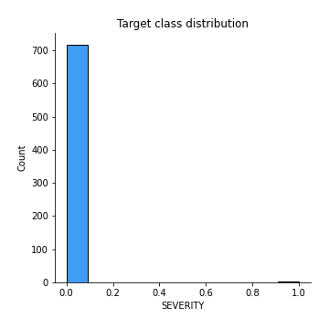
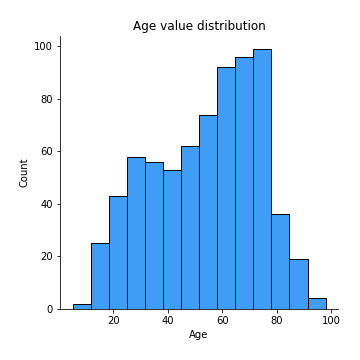
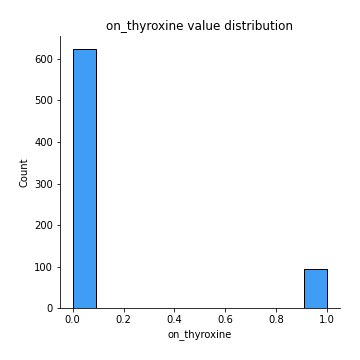
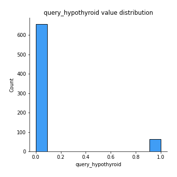
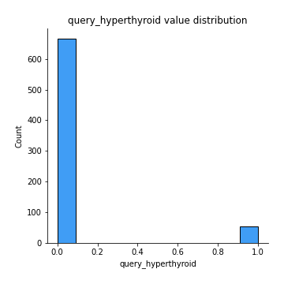
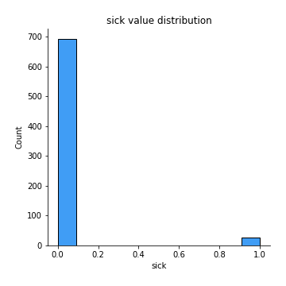
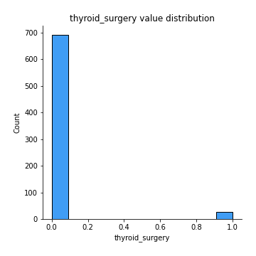
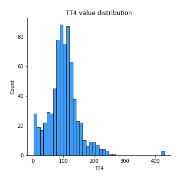
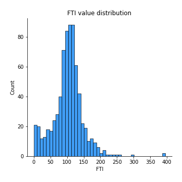

# Exploratory Data Analysis

[<< Go back](../README.md)
## Feature : target
- **Feature type** : discrete
- **Missing** : 0.0%
- **Unique** : 2
- **Count** :719.0
- **Mean** :0.0027816411682892906
- **Std** :0.052704525576503576
- **Min** :0.0
- **25%th Percentile** : 0.0
- **50%th Percentile** : 0.0
- **75%th Percentile** : 0.0
- **Max** :1.0

## Feature : Age
- **Feature type** : continous
- **Missing** : 0.0%
- **Unique** : 81
- **Count** :719.0
- **Mean** :53.89568845618915
- **Std** :19.517550727451102
- **Min** :5.0
- **25%th Percentile** : 38.0
- **50%th Percentile** : 57.0
- **75%th Percentile** : 70.0
- **Max** :98.0

## Feature : on_thyroxine
- **Feature type** : discrete
- **Missing** : 0.0%
- **Unique** : 2
- **Count** :719.0
- **Mean** :0.13212795549374132
- **Std** :0.33886555831619286
- **Min** :0.0
- **25%th Percentile** : 0.0
- **50%th Percentile** : 0.0
- **75%th Percentile** : 0.0
- **Max** :1.0

## Feature : query_hypothyroid
- **Feature type** : discrete
- **Missing** : 0.0%
- **Unique** : 2
- **Count** :719.0
- **Mean** :0.08762169680111266
- **Std** :0.282940767400677
- **Min** :0.0
- **25%th Percentile** : 0.0
- **50%th Percentile** : 0.0
- **75%th Percentile** : 0.0
- **Max** :1.0

## Feature : query_hyperthyroid
- **Feature type** : discrete
- **Missing** : 0.0%
- **Unique** : 2
- **Count** :719.0
- **Mean** :0.0737134909596662
- **Std** :0.26148596413898767
- **Min** :0.0
- **25%th Percentile** : 0.0
- **50%th Percentile** : 0.0
- **75%th Percentile** : 0.0
- **Max** :1.0

## Feature : sick
- **Feature type** : discrete
- **Missing** : 0.0%
- **Unique** : 2
- **Count** :719.0
- **Mean** :0.037552155771905425
- **Std** :0.19024281432979423
- **Min** :0.0
- **25%th Percentile** : 0.0
- **50%th Percentile** : 0.0
- **75%th Percentile** : 0.0
- **Max** :1.0

## Feature : thyroid_surgery
- **Feature type** : discrete
- **Missing** : 0.0%
- **Unique** : 2
- **Count** :719.0
- **Mean** :0.037552155771905425
- **Std** :0.1902428143297942
- **Min** :0.0
- **25%th Percentile** : 0.0
- **50%th Percentile** : 0.0
- **75%th Percentile** : 0.0
- **Max** :1.0

## Feature : TT4
- **Feature type** : continous
- **Missing** : 0.0%
- **Unique** : 203
- **Count** :719.0
- **Mean** :100.825173852573
- **Std** :50.44924659879638
- **Min** :2.0
- **25%th Percentile** : 75.0
- **50%th Percentile** : 99.0
- **75%th Percentile** : 123.0
- **Max** :430.0

## Feature : FTI
- **Feature type** : continous
- **Missing** : 0.0%
- **Unique** : 191
- **Count** :719.0
- **Mean** :102.3787204450626
- **Std** :45.46129371471529
- **Min** :0.0
- **25%th Percentile** : 81.0
- **50%th Percentile** : 105.0
- **75%th Percentile** : 124.0
- **Max** :395.0

[<< Go back](../README.md)
